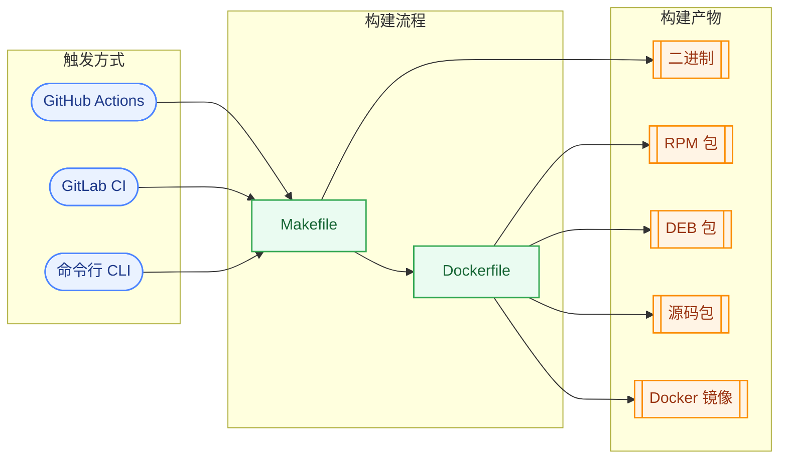

# 太极

> 无极生太极，太极生两仪。。。
> 一个go脚手架,目的是能够编译出多平台的二进制,镜像,rpm,debu,等格式的软件包，自动生成版本且保持一致

## 安装

* 使用go安装

```shell
go install github.com/naturelr/taiji
```

* 源码安装

```shell
git clone github.com/naturelr/taiji
cd taiji
make build
make install
```

## 使用

```shell
cd <项目目录>
```

`<文件类型>`不写则生成所有文件

GOPATH 下:

```shell
taiji init <文件类型>
```

非GOPATH 下:

```shell
taiji init <文件类型> --mod=<模块名字>
```

## 文件说明

### 命令行

* 命令使用[cobra](https://github.com/spf13/cobra)详情可以查看官方文档,创建的cmd文件夹即为`cobra`的命令入口

### 配置文件

配置使用[viper](https://github.com/spf13/viper),读取配置文件名字为`config.yaml`;
默认会读取以下目录

1. 程序的根目录

2. 程序下的config目录

3. /etc/<程序的名字>目录

4. 用户配置目录

### Dockerfile

采用多阶编译,镜像中修改时区为国内，以及镜像源替换为国内的命令

### Makefile

在编译的时候注入版本信息到go文件中,如果有tag则为tag版本没有则为提交次数和hash,提供常用系统下的交编译命令,去除了字符链接缩小体积

### 产物

```text
artifacts
├── bin
│   ├── test
│   ├── test-1.8f66f5e-darwin-amd64
│   ├── test-1.8f66f5e-darwin-arm64
│   ├── test-1.8f66f5e-linux-amd64
│   ├── test-1.8f66f5e-linux-arm64
│   ├── test-1.8f66f5e-windows-amd64.exe
│   └── test-1.8f66f5e-windows-arm64.exe
├── deb
│   └── test-1.8f66f5e-arm64.deb
├── rpm
│   ├── RPMS
│   │   └── aarch64
│   │       └── test-1.8f66f5e-1.el7.aarch64.rpm
│   └── SRPMS
│       └── test-1.8f66f5e-1.el7.src.rpm
└── tgz
    └── test-1.8f66f5e.tar.gz
```

## 关系图


